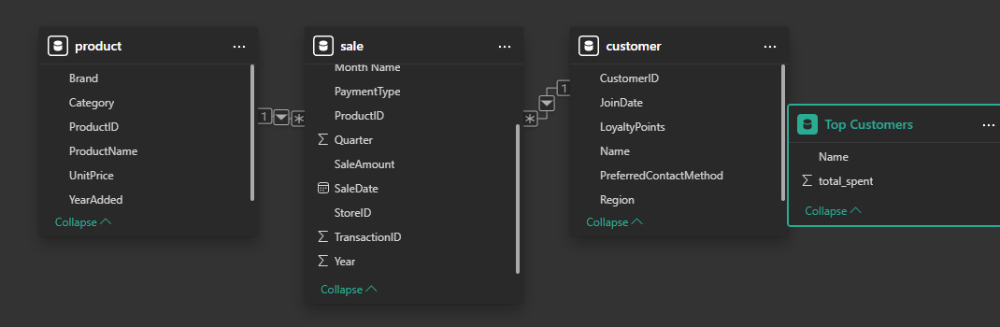
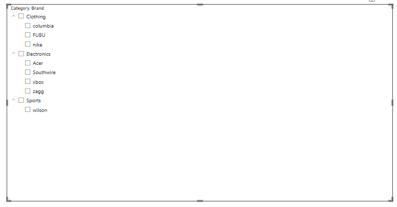

1. Get Started
Verify You've Created a Local Project Virtual Environment
This assumes you have a local project virtual environment on your machine in the .venv folder.

In VS Code, in your project repository folder, open a new terminal. (Terminal / New Terminal. I use the default on Mac and PowerShell on Windows.)

Create a virtual environment:

python -m venv .venv
Verify a new folder named .venv is available. You must be able to see hidden files and folders on your machine.

⭐Activate the Virtual Environment (Always)
Every time you open a new terminal and work on the project, be sure to activate the project virtual environment.

In Windows / PowerShell:

.\.venv\Scripts\activate
In macOS/Linux terminal:

source .venv/bin/activate
⭐Your .venv may appear in the terminal prompt when active.

Verify You've Installed All Required Packages (As Needed)
With the virtual environment activated, install the most current versions of the required packages which should be listed in your requirements.txt:

python -m pip install --upgrade -r requirements.txt
Hit the up arrow to rerun your installation command.

2. Implement and Test General DataScrubber Class
⭐Run the Test Script
In your VS Code terminal, ith your local project virtual environment active (and all necessary packages installed), run the test script with the following command.

In Windows / PowerShell:

py tests\test_data_scrubber.py
In macOS/Linux terminal:

python3 tests\test_data_scrubber.py
The first time you run it, all tests will not pass correctly.

⭐Finish DataScrubber Until All Tests Pass Successfully
Edit your scripts\data_scrubber.py file to complete the TODO actions. Verify by running the test script. Once all tests pass, you are ready to use the Data Scrubber in your data_prep.py (or other data preparation script).

⭐3. Complete all Data Preparation
For this step, use pandas and the DataScrubber class as needed to clean and prepare each of the raw data files.

We have an example data_prep.py file provided that illustrates common cleaning tasks and how to use the DataScrubber class.

Right now, all files are cleaned in a single scripts/data_prep.py file, but you may find it better to have smaller files, maybe one per raw data table.

Given the examples and the work done previously, read, clean, and preprocess all your raw data files and save the prepared versions in the data/prepared folder.

We recommand a naming scheme - following this will make future assignments a bit easier as we will use these file names and locations, however, you are welcome to vary the names. Your future scripts will need to correctly reflect your folder and file naming conventions. Changing is harder and better for learning. If new, please follow our folder and file naming conventions exactly.

If your file is in the scripts folder, with a name of data_prep.py, you can run it with the appropriate command from a VS Code terminal open in the root project folder:

In Windows / PowerShell:

py scripts\data_prep.py
In macOS/Linux terminal:

python3 scripts\data_prep.py
py scripts/create_dw.py

4. ETL and DW Creatation/population
pyspark 

5 Power BI visualization and reporting 

finally got a string of code to work for module 5! so proud!
let
    Source = Odbc.Query(
        "dsn=SmartSalesDSN;",
        "
        SELECT c.Name, SUM(s.SaleAmount) AS total_spent
        FROM sale s
        JOIN customer c ON s.CustomerID = c.customerid
        GROUP BY c.Name
        ORDER BY total_spent DESC
        "
    )
in
    Source

Step 6 - Create DSN (SmartSalesDSN) and connect Microsoft Power BI Desktop to ODBC Data Source (SmartSalesDSN)

Use Power BI to create a "Top Customers" SQL query that will query total sales per customer

Use Power BI to create visualizations: 
bar chart of Top Customers query,

 line chart of Sales Trends, 

 and a slicer displaying product brands by category.

 OLAP
.\.venv\Scripts\activate

py scripts\olap_cubing.py

py scripts\olap_goal_top_product_by_day.py

I have Chat GPT to thank for everything. Thanks Chat GPT!!!!!!